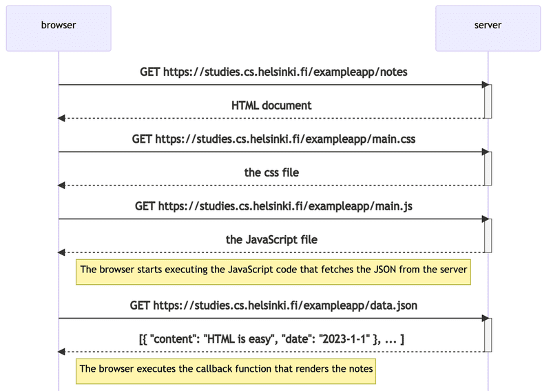

>Notes by HarishTQ
```toc
```
# Part0 - Fundamentals of Web Apps

> The first rule of web development is to always have the Developer Console open on your web browser.

The server and the web browser communicate with each other using the [HTTP](https://developer.mozilla.org/en-US/docs/Web/HTTP) protocol.  
The chain of events caused by opening the page [https://studies.cs.helsinki.fi/exampleapp](https://studies.cs.helsinki.fi/exampleapp) on a browser forms the following [sequence diagram](https://www.geeksforgeeks.org/unified-modeling-language-uml-sequence-diagrams/):


The chain of events caused by opening the page https://studies.cs.helsinki.fi/exampleapp/notes


1. The first request retrieves the HTML code of the page, which does not contain the list of notes but rather a script tag that fetches a JavaScript file. 
2. The JavaScript code in the file downloads JSON data containing notes, creates an unordered list, and adds a list item for each note's content.
```js
// Request to server
var xhttp = new XMLHttpRequest()

xhttp.onreadystatechange = function() {
  // code that takes care of the server response
}

xhttp.open('GET', '/data.json', true)
xhttp.send()
```

 Document Object Model : We can think of HTML pages as implicit tree structures.
 DOM is an Application Programming Interface (_API_) that enables programmatic modification of the _element trees_ corresponding to web pages.
```js
var ul = document.createElement('ul')

data.forEach(function(note) {
  var li = document.createElement('li')

  ul.appendChild(li)
  li.appendChild(document.createTextNode(note.content))
})
document.getElementsByClassName('notes').appendChild(ul)
```

The topmost node of the DOM tree of an HTML document is called the _document_ object. We can perform various operations on a webpage using the DOM-API. You can access the _document_ object by typing _document_
```js
list = document.getElementsByTagName('ul')[0]

newElement = document.createElement('li')
newElement.textContent = 'Page manipulation from console is easy'

list.appendChild(newElement)
```

**Form :**
1.  The Notes page has a form element for adding new notes.
2.  When the user clicks the button to submit the form, the browser sends the user input to the server as an HTTP POST request to the address new_note.
3.  The server adds the new note to an array called notes.
4.  The server responds with a redirect to the Notes page using an HTTP status code 302.
5.  The browser reloads the Notes page, causing three more HTTP requests: fetching the style sheet, the JavaScript code, and the raw data of the notes.
6.  The new note disappears when the server is restarted because the server does not save new notes to a database

__Ajax :__
-   The Notes page uses AJAX to fetch the notes data.
-   AJAX (Asynchronous JavaScript and XML) is a term introduced in February 2005 on the back of advancements in browser technology to describe a new revolutionary approach that enabled the fetching of content to web pages using JavaScript included within the HTML, without the need to rerender the page.
-   Before the AJAX era, all web pages worked like the traditional web application we saw earlier in this chapter. All of the data shown on the page was fetched with the HTML code generated by the server.
-   The application URLs reflect the old, carefree times.
-   JSON data is fetched from the URL [https://studies.cs.helsinki.fi/exampleapp/data.json](https://studies.cs.helsinki.fi/exampleapp/data.json).
-   New notes are sent to the URL [https://studies.cs.helsinki.fi/exampleapp/new_note](https://studies.cs.helsinki.fi/exampleapp/new_note).
-   Nowadays URLs like these would not be considered acceptable, as they don't follow the generally acknowledged conventions of RESTful APIs.

**SPA :**

The example app has a traditional home page where all the logic is on the server and the browser only renders HTML. However, the Notes page is different and has some responsibility to generate HTML code for existing notes, which is done by executing the JavaScript code in the browser. The data for the notes is fetched from the server as JSON data, and the browser adds HTML elements for displaying the notes to the page using the DOM-API.

Single-page applications (SPA) have become popular in recent years. Unlike the example app, SPA-style websites don't fetch all of their pages separately from the server, but instead comprise only one HTML page fetched from the server, the contents of which are manipulated with JavaScript that executes in the browser. The Notes page of the example app bears some resemblance to SPA-style apps, but it still uses the traditional way of adding new notes.

# Part 1 : Introduction to React

## a . Introduction to React

> To create a react app use `npm create vite@latest` or `npx create-react-app`

### Default Code for React
```js
//index.js
import React from 'react'
import ReactDOM from 'react-dom/client'

import App from './App'

ReactDOM.createRoot(document.getElementById('root')).render(<App />)

//App.js
const App = () => (
  <div>
    <p>Hello world</p>
  </div>
)

export default App
```
App.js defines a React component named "App". The final line in index.js uses ReactDOM to render the "App" component into the "div" element with ID "root" in public/index.html.

### Rendering Content
```js
//App.jsz
const App = () => {
  const now = new Date()
  const a = 10
  const b = 20
  console.log(now, a+b)

  return (
    <div>
      <p>Hello world, it is {now.toString()}</p>
      <p>
        {a} plus {b} is {a + b}
      </p>
    </div>
  )
}
//App.js Compiled to js
const App = () => {
  const now = new Date()
  const a = 10
  const b = 20
  return React.createElement(
    'div',
    null,
    React.createElement(
      'p', null, 'Hello world, it is ', now.toString()
    ),
    React.createElement(
      'p', null, a, ' plus ', b, ' is ', a + b
    )
  )
```
React components use JSX to define their layout, which is similar to HTML but written in JavaScript. JSX is compiled into JavaScript by Babel.
JSX allows for embedding dynamic content using JavaScript within curly braces, making it easy to create dynamic web applications.

### Multiple Components
```jsx
const Hello = () => {  
	return (    
		<div>   
			<p>Hello world</p>    
		</div>  
	)
}
const App = () => {
  return (
		<div>
	      <h1>Greetings</h1>
	      <Hello />
	      <Hello />      
	      <Hello />
	    </div>
  )
}
```
In the modified file "App.js", a new component named "Hello" is defined and used inside the "App" component. The same component can be used multiple times in the "App" component. React makes it easy to write and combine components, allowing for a maintainable application.
The convention in React is to have a root component named "App" at the top of the component tree,

### Props: Passing Data to Components
```jsx
const Hello = (props) => {
  console.log(props)  
  return (
    <div>
      <p>
        Hello {props.name}, you are {props.age} years old      
	  </p>
    </div>
  )
}

const App = () => {
  const name = 'Peter'  const age = 10
  return (
    <div>
      <h1>Greetings</h1>
      <Hello name='Maya' age={26 + 10} />      
      <Hello name={name} age={age} />    
    </div>
  )
}
```
Props are used to pass data to components in React. The component function can receive a props parameter, which is an object with fields corresponding to all the props passed to it.

1. A React component must contain a single root element for its content to be valid.
2. React component names are required to start with a capital letter.
3. An array of components can be used instead of a root element
4. Fragment groups child elements without adding extra nodes to the DOM `<> </>`
5. When building a React application, avoid rendering objects as they are not valid as a React child.
6. In React, the individual things rendered in braces must be primitive values, such as numbers or strings.
```jsx
const App = () => {
  const friends = [
    { name: 'Peter', age: 4 },
    { name: 'Maya', age: 10 },
  ]

  return (
    <div>
      <p>{friends[0].name} {friends[0].age}</p>
      <p>{friends[1].name} {friends[1].age}</p>
    </div>
  )
}

export default App
```

## b . JavaScript

### Variables
```js
const x = 1;
let y = 2;
x+=2; // Causes an error
y+=2; //Dosent cause an error
```
const creates a constant value that cannot be changed, while let defines a normal variable that can be updated.
[Should You Use let, var or const?](https://medium.com/craft-academy/javascript-variables-should-you-use-let-var-or-const-394f7645c88f)

### Arrays
```js
const a = [1,2,3,4,5];
a.push(6);
console.log(a.length);

a.forEach(value => {})

const b = a.concat(7) //This create a new array
const c = a.map(value=>value*2) //This creates a array [2,4,6,8,10,12]

const [first,second,...rest] = a; // first contains 1,second contains 2,rest contains [3,4,5,6]
```
1. An array is a collection of data that can be modified. The values in an array can be accessed and changed. One way to add values to an array is by using the push method. The forEach method can be used to iterate through the array.
2. It's important to note that even though an array is defined as a const, its contents can be modified because the variable points to the same object.
3. In React, it's recommended to use immutable data structures. Instead of modifying the original array, it's better to create a new one using methods like concat.
4. In React, it's recommended to use immutable data structures. Instead of modifying the original array, it's better to create a new one using methods like concat.
5. To access individual items in an array, the destructuring assignment can be used to assign them to variables.

### Objects
```js
const object = {
	name : "Harish",
	age : 20,
}
console.log(object.name)
console.log(object[age])

object.favNum = 20;
```
1. JavaScript objects can be defined using object literals, where the properties are listed within braces.
2. The properties can have any type of values, and can be referenced using the "dot" notation or brackets.
3. Objects can also have methods, which are defined using constructor functions

### Functions
```js
const sum = (p1,p2)=>{return p1+p2};
const square = (p) =>{return p*p}
const square = p => {return p*p}
const squre = p => p*p

const t = [1, 2, 3]
const tSquared = t.map(p => p * p)

```
1. To define an arrow function, we typically use the arrow syntax, with parameters enclosed in parentheses followed by the arrow and the function body enclosed in curly braces.
2. We can also exclude the parentheses if there is only one parameter and remove the braces if there is only one expression in the function body.

## c . Component state, event handlers

### Component Helper Functions 
```js
const Hello = (props) => {
  const bornYear = () => {
    const yearNow = new Date().getFullYear();
    return yearNow - props.age;
  };
  return (
    <div>
      <p>
        Hello {props.name}, you are {props.age} years old
      </p>
      <p>So you were probably born in {bornYear()}</p>{" "}
    </div>
  );
};

```
Separating the logic for guessing the year of birth into its own function makes the code more organized and easier to read.

### Destructuring
```js
const Hello = ({ name, age }) => {  const bornYear = () => new Date().getFullYear() - age

  return (
    <div>
      <p>
        Hello {name}, you are {age} years old
      </p>
      <p>So you were probably born in {bornYear()}</p>
    </div>
  )
}
```
1. In JavaScript, destructuring allows us to extract and assign values from arrays and objects directly into variables.
2. We can also use destructuring to extract values directly from the props object passed to our component function. This allows us to assign the values of the object's properties directly to variables without having to assign the entire object to a variable first.
3. For example, instead of referencing `props.name` and `props.age`, we can assign those values directly to `name` and `age` using destructuring.

### Stateful Components
All of our components up till now have been simple in the sense that they have not contained any state that could change during the lifecycle of the component.
We can add state to react using `useState`
```js
import { useState } from 'react'

const App = () => {
  const [ counter, setCounter ] = useState(0)

  setTimeout(
    () => setCounter(counter + 1),
    1000
  )

  console.log('rendering...', counter)
  return (
    <div>{counter}</div>
  )
}
```
1. The useState function call adds state to the component, initializing it to zero.
2. The function returns an array with two items that are destructured and assigned to the variables counter and setCounter. 
3. The counter variable is initialized to the value of the state, which is zero, and the setCounter variable is assigned a function that can modify the state.

### Event Handling
Event handling refers to the process of registering functions to be called when certain events occur.
```jsx
const App = () => {
  const [ counter, setCounter ] = useState(0)
  const handleClick = () => {
	  console.log('clicked')
  }
  return (
    <div>
      <div>{counter}</div>
      <button onClick={() => setCounter(counter + 1)}>
        plus
      </button>
      <button onClick={() => setCounter(0)}>         zero      </button>
	  <button onClick={handleClick}>Click</button>   
	</div>
	)
}
```
1. In the case of web pages, user interactions can trigger a variety of events.
2. In this example, we want to increase a counter when a user clicks a button on the page. We use the button element and its click event to achieve this.
3. In React, we can register an event handler function to the click event by setting the onClick attribute of the button to reference the function. 
4. In this case, we use the handleClick function to increase the counter and re-render the component.
5. We can also define the event handler function directly in the onClick attribute. Finally, we add a button to reset the counter to zero, and our application is complete.
6. The onClick attribute requires a function or a reference to a function, but not an actual function call.

### Passing State to child components
```jsx
const Button = (props) => {
  return (
    <button onClick={props.handleClick}>
      {props.text}
    </button>
  )
}

const App = () => {
  const [counter, setCounter] = useState(0);

  const increaseByOne = () => setCounter(counter + 1);
  const decreaseByOne = () => setCounter(counter - 1);
  const setToZero = () => setCounter(0);

  return (
    <div>
      <Display counter={counter} />
      <Button handleClick={increaseByOne} text="plus" />{" "}
      <Button handleClick={setToZero} text="zero" />{" "}
      <Button handleClick={decreaseByOne} text="minus" />{" "}
    </div>
  );
};
```
1. It's recommended to write React components that are small and reusable across the application and even across projects. Let's refactor our application so that it's composed of three smaller components, one component for displaying the counter and two components for buttons.
2. Often, several components need to reflect the same changing data. We recommend lifting the shared state up to their closest common ancestor.

### Change in State causes Rerendering 
```js
const App = () => {
  const [counter, setCounter] = useState(0);
  console.log("rendering with counter value", counter);
  const increaseByOne = () => {
    console.log("increasing, value before", counter);
    setCounter(counter + 1);
  };

  const decreaseByOne = () => {
    console.log("decreasing, value before", counter);
    setCounter(counter - 1);
  };

  const setToZero = () => {
    console.log("resetting to zero, value before", counter);
    setCounter(0);
  };

  return (
    <div>
      <Display counter={counter} />
      <Button handleClick={increaseByOne} text="plus" />
      <Button handleClick={setToZero} text="zero" />
      <Button handleClick={decreaseByOne} text="minus" />
    </div>
  );
};
```
1. In React, the state represents the current state of the application. Whenever there is a change in the state of a component, React re-renders the component, which means that it updates the component to reflect the new state.
2. This is because the state is the source of truth for a component. When the state changes, React assumes that the component needs to be updated to reflect the new state. So, React compares the current state of the component to the previous state and calculates the differences between them. It then applies the necessary updates to the component's virtual DOM, and if there are any changes, it re-renders the component.
3. When a component is re-rendered, all of its child components are also re-rendered. This can be an expensive operation, especially if the component tree is large or the rendering logic is complex. Therefore, it's important to be mindful of the performance impact of state changes, and to optimize rendering wherever possible.
4. We can also refractor components :) ???]

## d. A more complex state, debugging React apps
### Complex State
```js
const App = () => {
  const [left, setLeft] = useState(0)
  const [right, setRight] = useState(0)

  return (
    <div>
      {left}
      <button onClick={() => setLeft(left + 1)}>
        left
      </button>
      <button onClick={() => setRight(right + 1)}>
        right
      </button>
      {right}
    </div>
  )
}
```
1. When an application requires a more complex state, the easiest way to handle it is by using the useState function multiple times to create separate "pieces" of state. This means that each "piece" of state is managed separately, allowing the component to access the functions that can update that specific piece of state.
2. t's important to note that it is forbidden in React to mutate state directly, since it can result in unexpected side effects. Changing state must always be done by setting the state to a new object.
```js
const App = () => {
  const [clicks, setClicks] = useState({
    left: 0, right: 0
  })

  const handleLeftClick = () => {
    const newClicks = { 
      left: clicks.left + 1, 
      right: clicks.right 
    }
    setClicks(newClicks)
  }

  const handleRightClick = () => {
    const newClicks = { 
      left: clicks.left, 
      right: clicks.right + 1 
    }
    setClicks(newClicks)
  }

  return (
    <div>
      {clicks.left}
      <button onClick={handleLeftClick}>left</button>
      <button onClick={handleRightClick}>right</button>
      {clicks.right}
    </div>
  )
}
```
1. The component's state or a piece of its state can be of any type. We could implement the same functionality by saving the click count of both the _left_ and _right_ buttons into a single object
2. We can define handleClicks using object spread
```js
const handleLeftClick = () => {
  const newClicks = { 
    ...clicks, 
    left: clicks.left + 1 
  }
  setClicks(newClicks)
}

const handleRightClick = () => {
  const newClicks = { 
    ...clicks, 
    right: clicks.right + 1 
  }
  setClicks(newClicks)
}
```
```js
const handleLeftClick = () =>
  setClicks({ ...clicks, left: clicks.left + 1 })

const handleRightClick = () =>
  setClicks({ ...clicks, right: clicks.right + 1 })
```

### Arrays in State 
```js
const App = () => {
  const [left, setLeft] = useState(0);
  const [right, setRight] = useState(0);
  const [allClicks, setAll] = useState([]);
  const handleLeftClick = () => {
    setAll(allClicks.concat("L"));
    setLeft(left + 1);
  };
  const handleRightClick = () => {
    setAll(allClicks.concat("R"));
    setRight(right + 1);
  };
  return (
    <div>
      {left}
      <button onClick={handleLeftClick}>left</button>
      <button onClick={handleRightClick}>right</button>
      {right}
      <p>{allClicks.join(" ")}</p>{" "}
    </div>
  );
};
```
-  Adding the new item to the array is accomplished with the [concat](https://developer.mozilla.org/en-US/docs/Web/JavaScript/Reference/Global_Objects/Array/concat) method, which does not mutate the existing array but rather returns a _new copy of the array_ with the item added to it.

### Update of state is async :
```jsx
const App = () => {
  const [left, setLeft] = useState(0);
  const [right, setRight] = useState(0);
  const [allClicks, setAll] = useState([]);
  const handleLeftClick = () => {
    setAll(allClicks.concat("L"));
    setLeft(left + 1);
  };
  const handleRightClick = () => {
    setAll(allClicks.concat("R"));
    setRight(right + 1);
  };
  return (
    <div>
      {left}
      <button onClick={handleLeftClick}>left</button>
      <button onClick={handleRightClick}>right</button>
      {right}
      <p>{allClicks.join(" ")}</p>
    </div>
  );
};
```
In this application, we're adding a piece of state called `total` that keeps track of the total number of button presses. We're updating this state in the event handlers for the left and right buttons, but we notice that the state update seems to be asynchronous and doesn't take effect immediately.

To fix the issue, we can store the updated value of `left` in a separate variable and use that variable to update both the `left` state and the `total` state in the event handler. This ensures that the correct value of `left` is used to calculate the total number of button presses:
```jsx
const App = () => {
  const [left, setLeft] = useState(0);
  const [right, setRight] = useState(0);
  const [allClicks, setAll] = useState([]);
  const [total, setTotal] = useState(0);
  
  const handleLeftClick = () => {
    setAll(allClicks.concat("L"));
    const updatedLeft = left + 1;
    setLeft(updatedLeft);
    setTotal(updatedLeft + right);
  };
  
  const handleRightClick = () => {
    setAll(allClicks.concat("R"));
    const updatedRight = right + 1;
    setRight(updatedRight);
    setTotal(left + updatedRight);
  };
  
  return (
    <div>
      {left} 
      <button onClick={handleLeftClick}>left</button>
      <button onClick={handleRightClick}>right</button> 
      {right}
      <p>{allClicks.join(" ")}</p>
       <p>total {total}</p>
    </div>
  );
};


```
We also need to apply the same fix to the `handleRightClick` event handler to ensure that the total count is correct even when the right button is clicked.

### Conditional Rendering
```jsx
const History = (props) => {
  if (props.allClicks.length === 0) {
    return (
      <div>
        the app is used by pressing the buttons
      </div>
    )
  }

  return (
    <div>
      button press history: {props.allClicks.join(' ')}
    </div>
  )
}

const Button = ({ handleClick, text }) => (  
	<button onClick={handleClick}>    
		{text}  
	</button>
)
const App = () => {
  const [left, setLeft] = useState(0)
  const [right, setRight] = useState(0)
  const [allClicks, setAll] = useState([])

  const handleLeftClick = () => {
    setAll(allClicks.concat('L'))
    setLeft(left + 1)
  }

  const handleRightClick = () => {
    setAll(allClicks.concat('R'))
    setRight(right + 1)
  }

  return (
    <div>
      {left}
      <Button handleClick={handleLeftClick} text='left' />
      <Button handleClick={handleRightClick} text='right' />
      {right}
      <History allClicks={allClicks} />
    </div>
  )
}
```
This code shows an example of conditional rendering in React. The History component conditionally renders either a message about how to use the app or a display of the button press history based on whether any buttons have been clicked.

### Debugging with console.log
Debugging is a crucial part of software development, and it's common to use `console.log()` statements to print out values and help understand the flow of our code. In React, we can use `console.log()` statements to debug our components and state.

Here's an example of using `console.log()` to debug a component's props
```js
const MyComponent = (props) => {
  console.log("props:", props);
  return (
    <div>
      {" "}
      <h1>Hello, {props.name}!</h1>{" "}
    </div>
  );
};
```
In this example, we're logging the `props` object to the console so we can see what values are being passed down to our component.

We can also use `console.log()` to debug state. Here's an example:
```jsx
const [count, setCount] = useState(0);

const handleClick = () => {
  setCount(count + 1);
  console.log("count:", count);
};

return (
  <div>
    <p>Count: {count}</p>
    <button onClick={handleClick}>Increment</button>
  </div>
);

```
Another way to debug with `console.log()` is to use the React Developer Tools extension for Chrome or Firefox. This tool provides a comprehensive view of your component hierarchy and state, making it easy to identify issues and debug your code.

It's important to remember to remove any `console.log()` statements before deploying your application to production, as they can affect performance and security.

### Rules of React:
```js
const App = () => {
  // these are ok
  const [age, setAge] = useState(0)
  const [name, setName] = useState('Juha Tauriainen')

  if ( age > 10 ) {
    // this does not work!
    const [foobar, setFoobar] = useState(null)
  }

  for ( let i = 0; i < age; i++ ) {
    // also this is not good
    const [rightWay, setRightWay] = useState(false)
  }

  const notGood = () => {
    // and this is also illegal
    const [x, setX] = useState(-1000)
  }

  return (
    //...
  )
}
```

The rules of Hooks in React are in place to ensure that hooks-based state functions are used correctly in the application. The most important rule is that the useState and useEffect hooks must not be called inside a loop, a conditional expression, or any place that is not a function defining a React component.

This is because hooks should always be called in the same order, and if they are not, the application will behave unpredictably. Hooks can only be called from the inside of a function body that defines a React component, which means they cannot be used in regular functions or outside of React components.

### A function that returns a function
Another way to define an event handler is to use a _function that returns a function_.
The _return value_ of the function is another function that is assigned to the _handler_ variable.
```js
const App = () => {
  const [value, setValue] = useState(10);

  const hello = () => {
    const handler = () => console.log("hello world");
    return handler;
  };
  return (
    <div>
      {value}
      <button onClick={hello()}>button</button>
    </div>
  );
};
```
We can simplify this to
```js
const hello = (who) => {
  return () => {
    console.log('hello', who)
  }
}
```
Since our _hello_ function is composed of a single return command, we can omit the curly braces and use the more compact syntax for arrow functions:
```js
const hello = (who) =>
  () => {
    console.log('hello', who)
  }
```
Revised Code :
```js
const App = () => {
  const [value, setValue] = useState(10)

  const setToValue = (newValue) => {
    console.log('value now', newValue)
    setValue(newValue)
  }

  return (
    <div>
      {value}
      <button onClick={() => setToValue(1000)}>
        thousand
      </button>
      <button onClick={() => setToValue(0)}>
        reset
      </button>
      <button onClick={() => setToValue(value + 1)}>
        increment
      </button>
    </div>
  )
}
```

### Passing Event Handlers to Child Components :
  
Let's extract the button into its own component:

```js
const Button = (props) => (
  <button onClick={props.handleClick}>
    {props.text}
  </button>
)
```

The component gets the event handler function from the _handleClick_ prop, and the text of the button from the _text_ prop. Lets use the new component:

```js
const App = (props) => {
  // ...
  return (
    <div>
      {value}
      <Button handleClick={() => setToValue(1000)} text="thousand" />      <Button handleClick={() => setToValue(0)} text="reset" />      <Button handleClick={() => setToValue(value + 1)} text="increment" />    </div>
  )
}
```

### Do Not Define Components Within Components - :)

# Part 2 : Communicating with server
## a. Rendering a collection, modules

> When something does not work, don't just guess what's wrong. Instead, log or use some other way of debugging.

seperate the things to be printed with commas
```js
console.log('props value is', props)
```

use Vscode snippets
```json
{
  "console.log": {
    "prefix": "clog",
    "body": [
      "console.log('$1')",
    ],
    "description": "Log output to console"
  }
}
```

### Rendering a module : 
We will generate list items using map function
```jsx
const App = (props) => {
  const { notes } = props

  return (
    <div>
      <h1>Notes</h1>
      <ul>
        {notes.map(note => <li key={note.id}>{note.content}</li>)}
      </ul>
    </div>
  )
}
```

### Key-attribute
The elements generated by the map method must each have a unique key value

### Map : How does map work
```js
const notes = [
  {
    id: 1,
    content: 'HTML is easy',
    important: true
  },
  {
    id: 2,
    content: 'Browser can execute only JavaScript',
    important: false
  },
  {
    id: 3,
    content: 'GET and POST are the most important methods of HTTP protocol',
    important: true
  }
]

const result = notes.map(note => note.id)
console.log(result)
//[2,4,6]
```

### Anti-pattern: Array Indexes as Keys
1.  Using array indexes as keys can lead to bugs and performance issues in React components.
2.  When an array is reordered or an item is added or removed, the indexes of other items may change, causing unnecessary re-renders.
3.  Using unique IDs or other stable values as keys can prevent these issues and lead to more efficient updates.
4.  If you don't have a unique identifier for each item in an array, you can use the item's index as a fallback key, but only if the order of the items is unlikely to change.


## b . Forms
### Simple form
```js
const App = (props) => {
  const [notes, setNotes] = useState(props.notes);

  const addNote = (event) => {
    
    console.log("button clicked", event.target);
  };
  
  return (
    <div>
      <h1>Notes</h1>
      <ul>
        {notes.map((note) => (
          <Note key={note.id} note={note} />
        ))}
      </ul>
      <form onSubmit={addNote}>
        {" "}
        <input /> <button type="submit">save</button>{" "}
      </form>{" "}
    </div>
  );
};
```
1. The _event_ parameter is the [event](https://reactjs.org/docs/handling-events.html) that triggers the call to the event handler function:
2. The event handler immediately calls the _event.preventDefault()_ method, which prevents the default action of submitting a form. The default action would, [among other things](https://developer.mozilla.org/en-US/docs/Web/API/HTMLFormElement/submit_event), cause the page to reload.
3. The target of the event stored in _event.target_ is logged to the console:

### Controlled component
```js
const App = (props) => {
  const [notes, setNotes] = useState(props.notes);
  const [newNote, setNewNote] = useState("a new note...");
  const addNote = (event) => {
	  event.preventDefault()
	  const noteObject = {
	    content: newNote,
	    important: Math.random() < 0.5,
	    id: notes.length + 1,
	  }
	  setNotes(notes.concat(noteObject))
	  setNewNote('')
	}


  const handleNoteChange = (event) => {
    console.log(event.target.value);
    setNewNote(event.target.value);
  };
  return (
    <div>
      <h1>Notes</h1>
      <ul>
        {notes.map((note) => (
          <Note key={note.id} note={note} />
        ))}
      </ul>
      <form onSubmit={addNote}>
        <input value={newNote} onChange={handleNoteChange} />
        <button type="submit">save</button>
      </form>
    </div>
  );
};

```
1. The component has a state called "newNote" that reflects the current value of an input field. When the user submits the form, the "addNote" function is called with the event object.
2. This function creates a new note object with the content from the "newNote" state, generates a unique identifier, and adds the note to the list of notes using the "concat" method. The function then resets the "newNote" state to an empty string to clear the input field.

### Filtering Displayed Elements
```jsx
import { useState } from "react";
import Note from "./components/Note";

const App = (props) => {
  const [notes, setNotes] = useState(props.notes);
  const [newNote, setNewNote] = useState("");
  const [showAll, setShowAll] = useState(true);
  
  const notesToShow = showAll
  ? notes
  : notes.filter(note => note.important === true)
  
  return (
    <div>
      <h1>Notes</h1>
      <div>
        <button onClick={() => setShowAll(!showAll)}>
          show {showAll ? "important" : "all"}
        </button>
      </div>
      <ul>
        {notesToShow.map((note) => (
          <Note key={note.id} note={note} />
        ))}
      </ul>
      <form onSubmit={addNote}>
        <input value={newNote} onChange={handleNoteChange} />
        <button type="submit">save</button>
      </form>
    </div>
  );
};
```

## c. Getting data from server

> We will use json-server to simulate a server

```bash
npx json-server --port 3001 --watch db.json
```

```json
//db.json
{
  "notes": [
    {
      "id": 1,
      "content": "HTML is easy",
      "important": true
    },
    {
      "id": 2,
      "content": "Browser can execute only JavaScript",
      "important": false
    },
    {
      "id": 3,
      "content": "GET and POST are the most important methods of HTTP protocol",
      "important": true
    }
  ]
}
```
We will create db.json in root directory

### Async or not
1. To start with our React application, our initial task is to retrieve existing notes from the address [http://localhost:3001/notes](http://localhost:3001/notes). 
2. In the part0 example project, we learned how to fetch data from a server using JavaScript, which involved using XMLHttpRequest or XHR object.
3. However, the use of XHR is no longer recommended as browsers now support the fetch method, which is based on promises and is preferred over the event-driven model used by XHR.
4. In JavaScript, IO operations are executed asynchronously, and the code execution continues immediately after calling an IO function without waiting for it to return. 
5. The event handler registered to the operation is called when the asynchronous operation is completed.
6. JavaScript engines are single-threaded, which means that they cannot execute code in parallel, so it is necessary to use a non-blocking model for executing IO operations. If a computation takes too long, the browser will get stuck during its execution.
7. However, today's browsers allow the running of parallelized code using web workers, but the event loop of an individual browser window is still handled by a single thread.

### Axios
```js
import axios from 'axios'

const promise = axios.get('http://localhost:3001/notes')
console.log(promise)

const promise2 = axios.get('http://localhost:3001/foobar')
console.log(promise2)
```
If, and when, we want to access the result of the operation represented by the promise, we must register an event handler to the promise. This is achieved using the method _then_:
```js
const promise = axios.get('http://localhost:3001/notes')

promise.then(response => {
  console.log(response)
})
```
1. After setting up json-server to run on port 3001, axios can be used to make HTTP GET requests. 
2. To use axios, it can be imported into the file like any other library.
3. The axios.get method returns a promise, which represents the eventual completion or failure of an asynchronous operation. 
4. A promise can have three distinct states: pending, fulfilled, or rejected.
5. When the axios.get method is called, it returns a promise that can be used to register an event handler using the then method. 
6. The callback function provided to the then method will be called with a response object as a parameter when the promise is fulfilled. 
7. The response object contains all the essential data related to the response of an HTTP GET request.
8. To chain method calls, each call can be placed on its own line for improved readability. 
9. Axios is able to parse the data returned by the server into a JavaScript array, since the server has specified that the data format is application/json; charset=utf-8 using the content-type header.
10. To fetch data from the server and render it in the App component, axios.get can be called within the component. The placement of the axios.get command within the component may not be immediately obvious.

### Effect Hook : useEffect
```js
import { useState, useEffect } from "react";
import axios from "axios";
import Note from "./components/Note";

const App = () => {
  const [notes, setNotes] = useState([]);
  const [newNote, setNewNote] = useState("");
  const [showAll, setShowAll] = useState(true);

  useEffect(() => {
    console.log("effect");
    axios.get("http://localhost:3001/notes").then((response) => {
      console.log("promise fulfilled");
      setNotes(response.data);
    });
  }, []);
  console.log("render", notes.length, "notes");
  // ...
};
```
1. effect hooks were introduced as a new feature that allows for side effects on function components. 
2. Side effects, such as data fetching and DOM manipulation, can be performed using effect hooks. 
3. Effect hooks are the appropriate tool for data fetching from a server. 
4. The App component has been modified to remove the need for passing data as props to it. 
5. Instead, the notes are retrieved from the server using Axios, a promise-based HTTP client.
6. The useEffect hook is used to fetch data from the server, and once the data is received, it is stored in the state using the setNotes function. 
7. The useEffect hook has two parameters, the first being the effect function and the second specifying how often the effect should be run. In our case, the second parameter is an empty array, which indicates that the effect is run only once during the initial rendering of the component. 
8. The effect function can be written in various ways, and it is not necessary to assign functions and promises to variables.
```js
const hook = () => {
  console.log('effect')
  axios
    .get('http://localhost:3001/notes')
    .then(response => {
      console.log('promise fulfilled')
      setNotes(response.data)
    })
}

useEffect(hook, [])
```

## d . Altering data in server

### Rest
In REST, resources are individual data objects that have a unique address, or URL, associated with them. For example, in our note-taking application, each note is a resource, and its URL would be notes/3, where 3 is the ID of the note.

To fetch a resource from the server, we use an HTTP GET request. For example, an HTTP GET request to notes/3 would return the note with the ID of 3. An HTTP GET request to the notes URL would return a list of all notes.

To create a new resource, such as a new note, we use an HTTP POST request to the notes URL. The data for the new resource is sent in the body of the request, in JSON format. The request must also include the Content-Type request header with the value application/json.

### Sending Data to the Server
```js
addNote = event => {
  event.preventDefault()
  const noteObject = {
    content: newNote,
    important: Math.random() > 0.5,
  }

  axios
    .post('http://localhost:3001/notes', noteObject)
    .then(response => {
      setNotes(notes.concat(response.data))      
      setNewNote('')    
      })
}
```
1. The new note is created as a JavaScript object and sent to the server using the axios post method. The response from the server is logged to the console.
2. To test the use Posman.

### Updating data in the Server
```js
const toggleImportanceOf = id => {
  const url = `http://localhost:3001/notes/${id}`
  const note = notes.find(n => n.id === id)
  const changedNote = { ...note, important: !note.important }

  axios.put(url, changedNote).then(response => {
    setNotes(notes.map(n => n.id !== id ? n : response.data))
  })
}
```
1. The first line creates a unique URL for each note based on its ID.
2. To modify a note, we use the array find method to locate it, and then create a new object that's an exact copy of the old note except for the "important" property, which is flipped.
3. We use the spread syntax to copy the old note's properties into the new object, and add new properties inside curly braces. 
4. The resulting object is a shallow copy, meaning that if any of the original object's properties were themselves objects, the copies in the new object would reference the same objects.
5. It's important to note that we don't directly modify the note object we want to change, because it's a reference to an item in the component's state array. Instead, we create a new object and send it to the server with a PUT request.
6. The callback function sets the component's notes state to a new array that contains all the items from the previous notes array, except for the old note which is replaced by the updated version returned by the server. 
7. We use the map method to conditionally add the updated note to the new array.

### Extracting Communication with Backend to its own module
```js
import axios from 'axios'
const baseUrl = 'http://localhost:3001/notes'

const getAll = () => {
  return axios.get(baseUrl)
}

const create = newObject => {
  return axios.post(baseUrl, newObject)
}

const update = (id, newObject) => {
  return axios.put(`${baseUrl}/${id}`, newObject)
}

export default { 
  getAll: getAll, 
  create: create, 
  update: update 
}
```
```js
const App = () => {
  // ...

  useEffect(() => {
    noteService.getAll().then((initialNotes) => {
      setNotes(initialNotes);
    });
  }, []);

  const toggleImportanceOf = (id) => {
    const note = notes.find((n) => n.id === id);
    const changedNote = { ...note, important: !note.important };

    noteService.update(id, changedNote).then((returnedNote) => {
      setNotes(notes.map((note) => (note.id !== id ? note : returnedNote)));
    });
  };

  const addNote = (event) => {
    event.preventDefault();
    const noteObject = {
      content: newNote,
      important: Math.random() > 0.5,
    };

    noteService.create(noteObject).then((returnedNote) => {
      setNotes(notes.concat(returnedNote));
      setNewNote("");
    });
  };

  // ...
};

```
-   The App component has too many responsibilities after adding the code for communicating with the backend server.
-   In order to follow the single responsibility principle, it is best to move this communication code into its own module.
-   A new "notes.js" file is created in the "src/services" directory to handle the communication with the server.
-   The "notes.js" module exports an object that contains three functions: getAll, create, and update, which deal with notes.
-   The module uses the axios library to make HTTP requests to the server.
-   The App component imports the "notes.js" module using the "import" statement.
-   The App component uses the functions provided by the module to communicate with the server and manage notes.
-   The functions in the module directly return the promises returned by the axios methods.
-   The module could be improved by only returning the response data from the HTTP requests, instead of the entire response object.
-   The modified functions in the module still return promises, but they now only contain the response data.

### Cleaner Syntax for Defining Object literals
In defining the object using this shorter notation, we make use of a [new feature](https://developer.mozilla.org/en-US/docs/Web/JavaScript/Reference/Operators/Object_initializer#Property_definitions) that was introduced to JavaScript through ES6, enabling a slightly more compact way of defining objects using variables.
```js
export default { 
  getAll, 
  create, 
  update 
}

const name = 'Leevi'
const age = 0
const person = { name, age }

```
However, since both the property fields and the variable names in the object are the same, it's enough to simply write the following in ES6 JavaScrip
The result is identical for both expressions. They both create an object with a _name_ property with the value _Leevi_ and an _age_ property with the value _0_.

### Promises and Errors
```js
axios
  .get('http://example.com/probably_will_fail')
  .then(response => {
    console.log('success!')
  })
  .catch(error => {
    console.log('fail')
  })
```
```js
const toggleImportanceOf = (id) => {
  const note = notes.find((n) => n.id === id);
  const changedNote = { ...note, important: !note.important };

  noteService
    .update(id, changedNote)
    .then((returnedNote) => {
      setNotes(notes.map((note) => (note.id !== id ? note : returnedNote)));
    })
    .catch((error) => {
      alert(`the note '${note.content}' was already deleted from server`);
      setNotes(notes.filter((n) => n.id !== id));
    });
};

```
If users are allowed to delete notes, it may cause issues where they try to change the importance of a note that has already been deleted. 
To simulate this situation, the getAll function of the note service returns a hardcoded note that doesn't exist on the server. 
When we attempt to change the importance of this note, a 404 not found error is displayed in the console.
However, users won't be able to tell that an error has occurred unless they have their console open. 
The current code doesn't handle promise rejection when an HTTP request fails.
We can handle promise rejection by providing the then method with a second callback function or using the catch method.
The error handler for rejected promises is usually defined using the catch method.
Removing an already deleted note from the application's state is done with the array [filter](https://developer.mozilla.org/en-US/docs/Web/JavaScript/Reference/Global_Objects/Array/filter) method, which returns a new array comprising only the items from the list for which the function that was passed as a parameter returns true for:
```js
notes.filter(n => n.id !== id)
```

## e . Adding styles to React app
```css
.error {
  color: red;
  background: lightgrey;
  font-size: 20px;
  border-style: solid;
  border-radius: 5px;
  padding: 10px;
  margin-bottom: 10px;
}
```
```js
const Notification = ({ message }) => {
  if (message === null) {
    return null
  }

  return (
    <div className='error'>
      {message}
    </div>
  )
}
```
```jsx
const App = () => {
  const [notes, setNotes] = useState([]);
  const [newNote, setNewNote] = useState("");
  const [showAll, setShowAll] = useState(true);
  const [errorMessage, setErrorMessage] = useState("some error happened...");
  const toggleImportanceOf = (id) => {
    const note = notes.find((n) => n.id === id);
    const changedNote = { ...note, important: !note.important };

    noteService
      .update(id, changedNote)
      .then((returnedNote) => {
        setNotes(notes.map((note) => (note.id !== id ? note : returnedNote)));
      })
      .catch((error) => {
        setErrorMessage(
          `Note '${note.content}' was already removed from server`
        );
        setTimeout(() => {
          setErrorMessage(null);
        }, 5000);
        setNotes(notes.filter((n) => n.id !== id));
      });
  };

  return (
    <div>
      <h1>Notes</h1>
      <Notification message={errorMessage} />{" "}
      <div>
        <button onClick={() => setShowAll(!showAll)}>
          show {showAll ? "important" : "all"}
        </button>
      </div>
      // ...
    </div>
  );
};

```

### Inline Styles
```js
const Footer = () => {
  const footerStyle = { color: "green", fontStyle: "italic", fontSize: 16 };
  return (
    <div style={footerStyle}>
      {" "}
      <br />{" "}
      <em>
        Note app, Department of Computer Science, University of Helsinki 2022
      </em>{" "}
    </div>
  );
};
const App = () => {
  // ...

  return (
    <div>
      <h1>Notes</h1>
      <Notification message={errorMessage} />
      // ...
      <Footer />{" "}
    </div>
  );
};

```

### Important Points
1. State should not be utillized with null even if ur using useEffect.
2. However the problem is that the effect is executed only _after the first render_.
3. The second parameter of _useEffect_ is used to [specify how often the effect is run](https://reactjs.org/docs/hooks-reference.html#conditionally-firing-an-effect). The principle is that the effect is always executed after the first render of the component _and_ when the value of the second parameter changes.
4. If the second parameter is an empty array _[]_, it's content never changes and the effect is only run after the first render of the component. This is exactly what we want when we are initializing the app state from the server.
 ```js
import { useState, useEffect } from 'react'
import axios from 'axios'

const App = () => {
  const [value, setValue] = useState('')
  const [rates, setRates] = useState({})
  const [currency, setCurrency] = useState(null)

  useEffect(() => {
    console.log('effect run, currency is now', currency)

    // skip if currency is not defined
    if (currency) {
      console.log('fetching exchange rates...')
      axios
        .get(`https://open.er-api.com/v6/latest/${currency}`)
        .then(response => {
          setRates(response.data.rates)
        })
    }
  }, [currency])

  const handleChange = (event) => {
    setValue(event.target.value)
  }

  const onSearch = (event) => {
    event.preventDefault()
    setCurrency(value)
  }

  return (
    <div>
      <form onSubmit={onSearch}>
        currency: <input value={value} onChange={handleChange} />
        <button type="submit">exchange rate</button>
      </form>
      <pre>
        {JSON.stringify(rates, null, 2)}
      </pre>
    </div>
  )
}
```
The application sets the name of the currency entered to the form to the state _currency_ at the moment the button is pressed.

When the _currency_ gets a new value, the application fetches its exchange rates from the API in the effect function:
The useEffect hook has now _[currency]_ as the second parameter. The effect function is therefore executed after the first render, and _always_ after the table as its second parameter _[currency]_ changes. That is, when the state _currency_ gets a new value, the content of the table changes and the effect function is execute