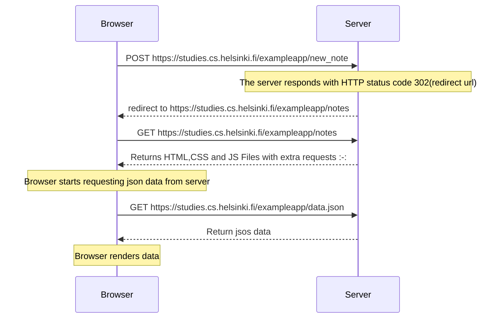

```mermaid
sequenceDiagram
    participant Browser
    participant Server

    Browser->>Server: POST https://studies.cs.helsinki.fi/exampleapp/new_note
    Note over Server: The server responds with HTTP status code 302(redirect url)
    Server-->>Browser: redirect to https://studies.cs.helsinki.fi/exampleapp/notes

    Browser->>Server: GET https://studies.cs.helsinki.fi/exampleapp/notes
    Server-->>Browser: Returns HTML,CSS and JS Files with extra requests :-:

    Note over Browser: Browser starts requesting json data from server

    Browser->>Server : GET https://studies.cs.helsinki.fi/exampleapp/data.json
    Server-->>Browser: Return jsos data

    Note over Browser: Browser renders data
```